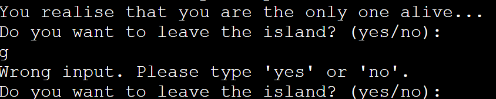

# LOST. A text-based adventure game

## How To Play

The game is called LOST.
Its a text based adventure game and it is quite easy to play as it requires minimal controls. All the player has to do is type in required words when prompted by the terminal.

The player's goal is to survive and get off the deserted island. The players has the choice to choose what direction they go. And their survival depends only on the choices they make.

As soon as the game loads the player is provided with a story on how the player ends up on a deserted island. 

## Features 
- __Name__ 

The user is provided with a name input 

- __Freedom of Choice__

The user is given freedon of choice over every choice they make in the game. If they want to pick up the Axe or the flare. If they want to eat the fruit or not.Their survival depends only on the user's choices.

__Game Over red text__

THe GAME OVER text comes in the red color and asks the user if they want to play again or not.

- __Winning game game text__

The CONGRATULATIONS text comes in green color followed by a YOU WON text.

- __Play Again__

Asks the user if they want to play again or not.

## Technologies

- Python was used as the programming language to make the game.
- LucidChart was used to create the flow chart showing the game's logic.
- GitHub has been used to store the code, images, and other content.
- Heroku was used to deploy the game to the web.
- Git was used to track changes made to the project and to commit and push code to the repository.
- Python module time has been used to allow for a delay between lines of text displaying.
- Python module sys has been used to print text by character instead of all at oncee.
- Colorama was used to make the Game over text red and the Congratulations text green

## Testing 

- Leave the island incorrect input
Only accepts yes or no as input input to procceed with the game.

- Left/Right/Inland Incorrect input 
Only acceps left ,Right or Inland input to procceed with the game.

- Stay or go incorrect input.
Only accepts stay or go as input input to procceed with the game.

- Axe incorrect input
Only accepts yes or no as input input to procceed with the game.

- Try again incorrect input.
Only accepts yes or no as input input to procceed with the game.

### Validator Testing 
No errors were found and the code is formatted up to standard.

### Bugs/Other

As far as testing goes. I have manually tested all the possible outcomes. The incorrect inputs given send a message asking the user to put the correct input to the terminal. Few incorrect input messages are not as quick as others so they might take few miliseconds or seconds to appear and alert the user.
I personally tested every function and every in-game scenario. So far everything works just fine.
## Deployment

## Credits 

 